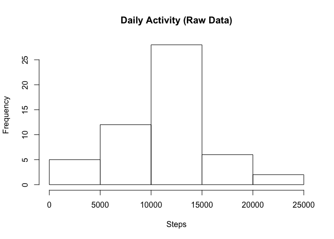
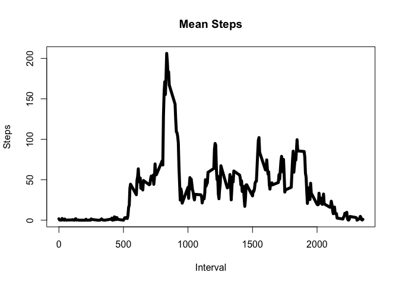
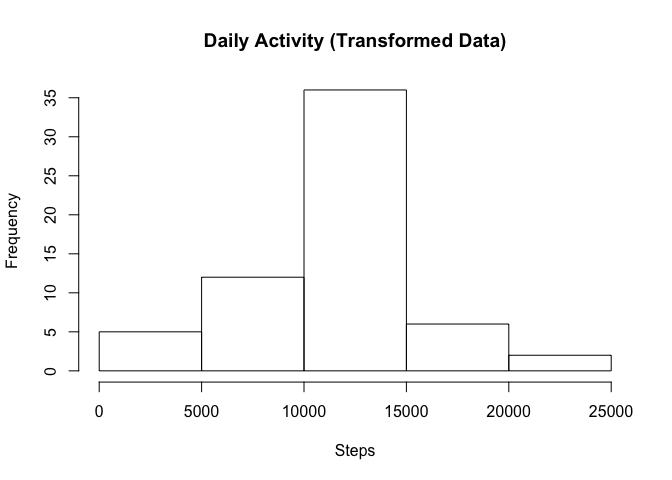
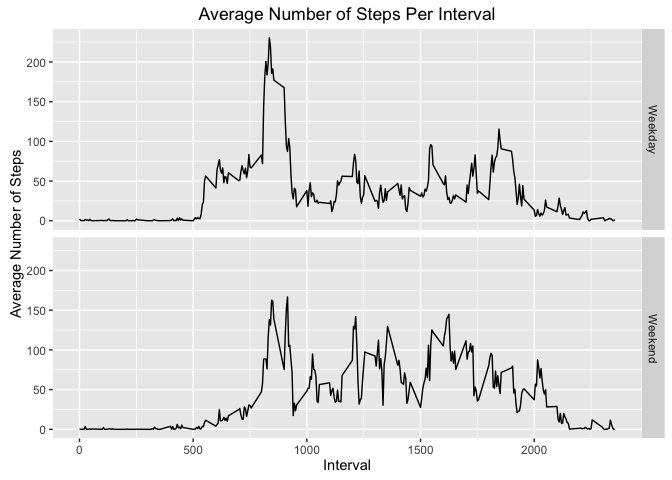

# Reproducible Research: Peer Assessment 1
Kiril D. Sakaliyski  
January 9, 2016  

## Loading and preprocessing the data

```r
activityData <- read.csv("activity.csv")
str(activityData)
```

```
## 'data.frame':	17568 obs. of  3 variables:
##  $ steps   : int  NA NA NA NA NA NA NA NA NA NA ...
##  $ date    : Factor w/ 61 levels "2012-10-01","2012-10-02",..: 1 1 1 1 1 1 1 1 1 1 ...
##  $ interval: int  0 5 10 15 20 25 30 35 40 45 ...
```

## What is mean total number of steps taken per day?
Calculate the total number of steps taken per day:

```r
dailyActivityData <- with(activityData, tapply(steps, date, sum))
dailyActivityDataDF <- data.frame(date=names(dailyActivityData),totalSteps=as.numeric(dailyActivityData))
```
The plot below shows a histogram of the total number of steps taken each day.

```r
hist(dailyActivityDataDF$totalSteps,main="Daily Activity (Raw Data)", xlab="Steps")
```

\
Calculate and report the mean and median of the total number of steps taken per day:

```r
sumarryDailySteps <- summary(dailyActivityDataDF$totalSteps)
print(sumarryDailySteps)
```

```
##    Min. 1st Qu.  Median    Mean 3rd Qu.    Max.    NA's 
##      41    8841   10760   10770   13290   21190       8
```
Mean of 10,770 and median of 10,760 number of steps taken per day.

## What is the average daily activity pattern?

```r
intervalActivityData <- with(activityData, tapply(steps, interval, mean,na.rm=TRUE))
intervalActivityDataDF <- data.frame(interval=as.numeric(names(intervalActivityData)),meanSteps=as.numeric(intervalActivityData))
```
A time series plot of the 5-minute interval (x-axis) and the average number of steps taken, averaged across all days (y-axis).

```r
plot(intervalActivityDataDF, type = "l", lwd = 5,main="Mean Steps",xlab = "Interval",ylab = 'Steps')
```

\


```r
intervalActivityDataDF[which.max(intervalActivityDataDF$meanSteps),]
```

```
##     interval meanSteps
## 104      835  206.1698
```
On average across all the days in the dataset, 8:35 5-minute interval contains the maximum number of steps 206.1698.

## Imputing missing values

```r
summary(activityData)
```

```
##      steps                date          interval     
##  Min.   :  0.00   2012-10-01:  288   Min.   :   0.0  
##  1st Qu.:  0.00   2012-10-02:  288   1st Qu.: 588.8  
##  Median :  0.00   2012-10-03:  288   Median :1177.5  
##  Mean   : 37.38   2012-10-04:  288   Mean   :1177.5  
##  3rd Qu.: 12.00   2012-10-05:  288   3rd Qu.:1766.2  
##  Max.   :806.00   2012-10-06:  288   Max.   :2355.0  
##  NA's   :2304     (Other)   :15840
```

```r
dim(activityData[is.na(activityData$steps),])
```

```
## [1] 2304    3
```
There are total of 2304 missing (NA) values.

The missing steps data is filled with the mean for that 5-minute interval estimated in the previous step.

```r
fillMissData <- function(df) {
        x <- as.numeric(df['steps'])
        if (is.na(x)) {
                # intervalActivityDataDF is generated in the previous step
                x <- intervalActivityDataDF$meanSteps[intervalActivityDataDF$interval==as.numeric(df['interval'])]
        }
        return(x)
}
```


```r
str(activityData)
```

```
## 'data.frame':	17568 obs. of  3 variables:
##  $ steps   : int  NA NA NA NA NA NA NA NA NA NA ...
##  $ date    : Factor w/ 61 levels "2012-10-01","2012-10-02",..: 1 1 1 1 1 1 1 1 1 1 ...
##  $ interval: int  0 5 10 15 20 25 30 35 40 45 ...
```

```r
trasformActivityData <- activityData
trasformActivityData$steps <- apply(activityData, 1, fillMissData)
str(trasformActivityData)
```

```
## 'data.frame':	17568 obs. of  3 variables:
##  $ steps   : num  1.717 0.3396 0.1321 0.1509 0.0755 ...
##  $ date    : Factor w/ 61 levels "2012-10-01","2012-10-02",..: 1 1 1 1 1 1 1 1 1 1 ...
##  $ interval: int  0 5 10 15 20 25 30 35 40 45 ...
```
The new full (no missing values) dataset is stored in trasformActivityData.

```r
dailyActivityDataTR <- with(trasformActivityData, tapply(steps, date, sum))
dailyActivityDataTRDF <- data.frame(date=names(dailyActivityDataTR),totalSteps=as.numeric(dailyActivityDataTR))
```
Histogram of the total number of steps taken each day.

```r
hist(dailyActivityDataTRDF$totalSteps,main="Daily Activity (Transformed Data)", xlab="Steps")
```

\
Calculate and report the mean and median total number of steps taken per day.

```r
sumarryTRDailySteps <- summary(dailyActivityDataTRDF$totalSteps)
```
Raw data stats:

```r
print(sumarryDailySteps)
```

```
##    Min. 1st Qu.  Median    Mean 3rd Qu.    Max.    NA's 
##      41    8841   10760   10770   13290   21190       8
```
Transformed data stats:

```r
print(sumarryTRDailySteps)
```

```
##    Min. 1st Qu.  Median    Mean 3rd Qu.    Max. 
##      41    9819   10770   10770   12810   21190
```
Quantile values differ from the estimates from the first part of the assignment (raw data) but mean, max and min stay the same (the mean fuction is linear).

## Are there differences in activity patterns between weekdays and weekends?
New factor variable (wkday) in the dataset with two levels – “weekday” and “weekend”:

```r
trasformActivityData$weekday <- weekdays(as.Date(trasformActivityData$date))
trasformActivityData$wkday <- matrix(data='weekday',nrow=nrow(trasformActivityData),ncol=1)
trasformActivityData$wkday[trasformActivityData$weekday=='Saturday' | trasformActivityData$weekday=='Sunday',] <- 'weekend'
trasformActivityData$wkday <- as.factor(trasformActivityData$wkday) 
str(trasformActivityData)
```

```
## 'data.frame':	17568 obs. of  5 variables:
##  $ steps   : num  1.717 0.3396 0.1321 0.1509 0.0755 ...
##  $ date    : Factor w/ 61 levels "2012-10-01","2012-10-02",..: 1 1 1 1 1 1 1 1 1 1 ...
##  $ interval: int  0 5 10 15 20 25 30 35 40 45 ...
##  $ weekday : chr  "Monday" "Monday" "Monday" "Monday" ...
##  $ wkday   : Factor w/ 2 levels "weekday","weekend": 1 1 1 1 1 1 1 1 1 1 ...
```
Subselect the data:

```r
weekdaysub <- with(subset(trasformActivityData, wkday == 'weekday'), tapply(steps, interval, mean))
weekdaysubdf <- data.frame(interval=as.numeric(names(weekdaysub)),dayType='Weekday',meanSteps=as.numeric(weekdaysub))

weekendsub <- with(subset(trasformActivityData, wkday == 'weekend'), tapply(steps, interval, mean))
weekendsubdf <- data.frame(interval=as.numeric(names(weekendsub)),dayType='Weekend',meanSteps=as.numeric(weekendsub))

intActivityDF <- rbind(weekdaysubdf,weekendsubdf)
```
A time series plot of the 5-minute interval (x-axis) and the average number of steps taken, averaged across all weekday days or weekend days (y-axis).

```r
library(ggplot2)
```

```
## Warning: package 'ggplot2' was built under R version 3.2.3
```

```r
p <- ggplot(data=intActivityDF, type='l',aes(interval, meanSteps)) + geom_path()
p + facet_grid(dayType ~ .) + labs(title = "Average Number of Steps Per Interval",x = "Interval",y = "Average Number of Steps")
```

\
